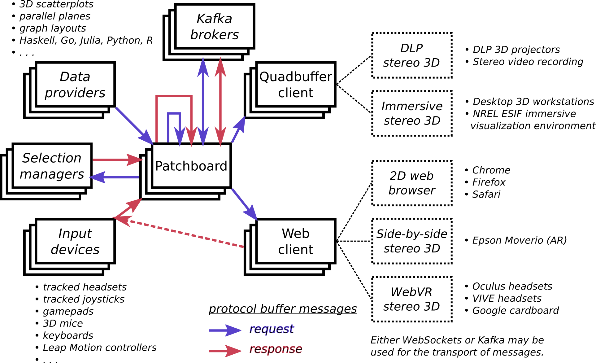
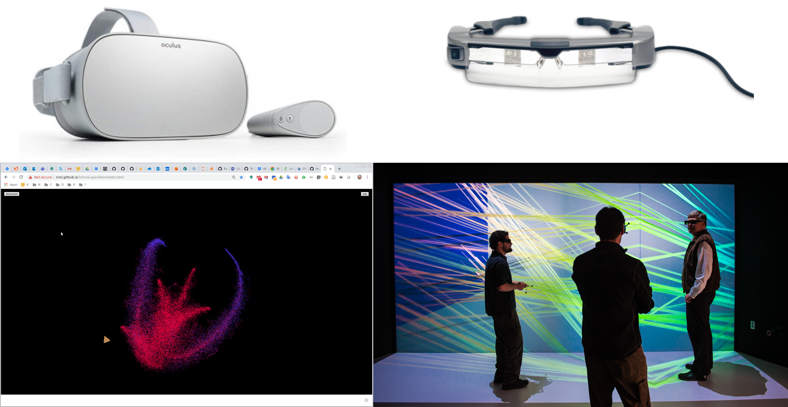

% InfoVis Parallel
% Technical Manual
% 2020-02-05

# Overview

## Objectives

### Goals

*   Rapid design of new parallel-coordinates layouts for multidimensional timeseries.
*   Ad-hoc, reconfigurable collaborative visualization environments.

### Principles

*   Clean, minimalist abstractions based on category theory.
*   Efficient use of bandwidth and memory.
*   Firewall friendly.
*   Portability across hardware and software platforms.
*   Low maintenance.

## Layers

*   A visualization language for expressing parallel-coordinates layouts and behaviors.
*   Microservices for composing dataflows.
*   A protocol buffer specification for embodying visual representations.
*   Wire transport via WebSockets and/or Kafka.

# Visualization language

## Elements

*   *Dataset:* Multidimensional data in a relational format.
*   *Presentation:* The binding of visualizations with variables and animation.
*   *Containers:* A grouping a layout.
    *   *Singleton:* A single layout.
    *   *Array:* A set of layouts.
    *   *Collection:* A set of containers.
*   *Extent:* The registration in 1D, 2D, or 3D of a container.
*   *Grid:* A local unit coordinate system associated with axes, their labels, and their styling.
    *   *LineGrid:* A 1D coordinate line.
    *   *RectangleGrid:* A 2D plot.
    *   *BoxGrid:* A 3D plot.
*   *Axis:* Coordinate axes in 1D, 2D, or 3D associated with variables.
*   *Link:* Parallel-coordinate linkages between axes.
    *   *Point:* Data rendered as points and invisibly linked across a set of grids.
    *   *Polyline:* Data rendered as polylines linked across an ordered set of grids.
*   *Styling:* The colors for normal data, selected data, highlighted data, and the thickness of lines.

## Semantics

*   Each data record has an unique ID.
    *   That record is rendered on each axis of each grid, according to the values of variables for the record.
*   Selection and highlighting operate on all renderings of the record for the specified IDs, across all of the grids and axes.
*   The type of linkages between grids determine how the record is rendered as points and/or polylines.
*   A single variable can be flagged for use in animation.

## Serialization

*   The visualization language is defined as Haskell algebraic datatypes (ADTs).
*   The visualization language is serialized as YAML or JSON, or in Haskell syntax.
*   A compiler is available to transform datasets according to the language specification into a stream of protocol buffer messages.

## Coordinates

*   Each *variable* is scaled to `[0,1]` according to the *dataset* metadata.
*   Each *grid* has a local `[0,1]` coordinate system for each of its axes.
*   The *extents* of the grid define an affine transformations from the local coordinate system into the coordinate system of its *container*.
*   *Containers* have their `[0,1]` coordinate systems and their own *extents*.
*   Thus, the scene graph is a hierarchy of nested unit coordinate systems related by affine transformations.

##
{ width=40% height=85% }

## Example Dataset

	dataset            :
	  datasetIdentifier: datasets/ENB2012.tsv
	  variables        :
	  - variableAlias  : Relative Compactness
	    variableName   : Relative Compactness
	    lowerBound     : 0.60
	    upperBound     : 1.00
	  - variableAlias  : Surface Area
	    variableName   : Surface Area
	    units          : m²
	    lowerBound     : 500
	    upperBound     : 825
	  - variableAlias  : Wall Area
	    variableName   : Wall Area
	    units          : m²
	    lowerBound     : 225
	    upperBound     : 425
	  - variableAlias  : Roof Area
	    variableName   : Roof Area
	    units          : m²
	    lowerBound     : 100
	    upperBound     : 225
	  - variableAlias  : Overall Height
	    variableName   : Overall Height
	    units          : m
	    lowerBound     : 3.25
	    upperBound     : 7.25
	  - variableAlias  : Orientation
	    variableName   : Orientation
	    units          : 2=N,3=E,4=S,5=W
	    lowerBound     : 1.9
	    upperBound     : 5.1
	  - variableAlias  : Glazing Area
	    variableName   : Glazing Area
	    lowerBound     : -0.01
	    upperBound     :  0.41
	  - variableAlias  : Glazing Area Distribution
	    variableName   : Glazing Area Distribution
	    units          : 0=unknown,1=uniform,2=N,3=E,4=W,5=W
	    lowerBound     : -0.01
	    upperBound     :  5.01
	  - variableAlias  : Heating Load
	    variableName   : Heating Load
	    units          : kWh/m²
	    lowerBound     :  5
	    upperBound     : 50
	  - variableAlias  : Cooling Load
	    variableName   : Cooling Load
	    units          : kWh/m²
	    lowerBound     :  5
	    upperBound     : 50

## Simple Example: 3D scatterplot

	presentation           :
	  uniqueKey            : Glazing Area Distribution
	  containers           :
	  - tag                : Singleton
	    extent             :
	      tag              : Extent3D
	      origin           : [0, 0, 1]
	      cornerX          : [1, 0, 1]
	      cornerY          : [0, 0, 0]
	      cornerZ          : [0, 1, 1]
	    grid               :
	      tag              : BoxGrid
	      gridAlias        : heatingBox
	      axes3D           :
	      - axisVariable   : Wall Area
	      - axisVariable   : Roof Area
	      - axisVariable   : Heating Load
	      divisions        : 5
	      lineStyling      :
	        normalColor    : 0x33333380
	        selectColor    : 0x666600CC
	        highlightColor : 0x660000CC
	        thickness      : 0.010
	      faceStyling      :
	        normalColor    : 0x33333300
	        selectColor    : 0x666600CC
	        highlightColor : 0x660000CC
	        thickness      : 0.010
	      axisColor        : 0x1A993340
	      axisSize         : 0.015
	      labelColor       : 0x1A9933FF
	      labelSize        : 0.050
	  links                :
	  - tag                : Point
	    linkAlias          : heatingScatterplot
	    linkedGrid         : heatingBox
	    styling            :
	      normalColor      : 0x0000FFCC
	      selectColor      : 0xCCCCCCFF
	      highlightColor   : 0xFF0000FF
	      thickness        : 0.005

## Complex Example: two 3D scatterplots, parallel planes, and parallel forest with animation

	presentation             :
	  animationKey           : Orientation
	  uniqueKey              : Glazing Area Distribution
	  containers             :
	  - tag                  : Collection
	    extents              :
	    - tag                : Extent3D
	      origin             : [0.05, 0.55, 0.05]
	      cornerX            : [0.45, 0.55, 0.05]
	      cornerY            : [0.05, 0.95, 0.05]
	      cornerZ            : [0.05, 0.55, 0.95]
	    - tag                : Extent3D
	      origin             : [0.55, 0.55, 0.05]
	      cornerX            : [0.95, 0.55, 0.05]
	      cornerY            : [0.55, 0.95, 0.05]
	      cornerZ            : [0.55, 0.55, 0.95]
	    containeds           :
	    - tag                : Singleton
	      extent             :
	        tag              : Extent3D
	        origin           : [0, 0, 0]
	        cornerX          : [1, 0, 0]
	        cornerY          : [0, 1, 0]
	        cornerZ          : [0, 0, 1]
	      grid               :
	        tag              : BoxGrid
	        gridAlias        : heatingBox
	        axes3D           :
	        - axisVariable   : Wall Area
	        - axisVariable   : Roof Area
	        - axisVariable   : Heating Load
	        divisions        : 10
	        lineStyling      :
	          normalColor    : 0x333333FF
	          selectColor    : 0x666600CC
	          highlightColor : 0x660000CC
	          thickness      : 0.005
	        faceStyling      :
	          normalColor    : 0x33333300
	          selectColor    : 0x666600CC
	          highlightColor : 0x660000CC
	          thickness      : 0.005
	        axisColor        : 0x1A993340
	        axisSize         : 0.010
	        labelColor       : 0x1A9933FF
	        labelSize        : 0.01
	    - tag                : Singleton
	      extent             :
	        tag              : Extent3D
	        origin           : [0, 0, 0]
	        cornerX          : [1, 0, 0]
	        cornerY          : [0, 1, 0]
	        cornerZ          : [0, 0, 1]
	      grid               :
	        tag              : BoxGrid
	        gridAlias        : coolingBox
	        axes3D           :
	        - axisVariable   : Wall Area
	        - axisVariable   : Roof Area
	        - axisVariable   : Cooling Load
	        divisions        : 0
	        lineStyling      :
	          normalColor    : 0x666666CC
	          selectColor    : 0x666600CC
	          highlightColor : 0x660000CC
	          thickness      : 0.005
	        faceStyling      :
	          normalColor    : 0x33333300
	          selectColor    : 0x666600CC
	          highlightColor : 0x660000CC
	          thickness      : 0.005
	        axisColor        : 0x1A993340
	        axisSize         : 0.010
	        labelColor       : 0x1A9933FF
	        labelSize        : 0.01
	  - tag                  : Array
	    extents              :
	    - tag                : Extent2D
	      origin             : [0.1, 0.1, 0.1]
	      cornerX            : [0.1, 0.1, 0.9]
	      cornerY            : [0.1, 0.4, 0.1]
	    - tag                : Extent2D
	      origin             : [0.2, 0.1, 0.1]
	      cornerX            : [0.2, 0.1, 0.9]
	      cornerY            : [0.2, 0.4, 0.1]
	    - tag                : Extent2D
	      origin             : [0.3, 0.1, 0.1]
	      cornerX            : [0.3, 0.1, 0.9]
	      cornerY            : [0.3, 0.4, 0.1]
	    - tag                : Extent2D
	      origin             : [0.4, 0.1, 0.1]
	      cornerX            : [0.4, 0.1, 0.9]
	      cornerY            : [0.4, 0.4, 0.1]
	    - tag                : Extent2D
	      origin             : [0.5, 0.1, 0.1]
	      cornerX            : [0.5, 0.1, 0.9]
	      cornerY            : [0.5, 0.4, 0.1]
	    grids                :
	    - tag                : RectangleGrid
	      gridAlias          : plane1
	      axes2D             :
	      - axisVariable     : Relative Compactness
	      - axisVariable     : Surface Area
	      divisions          : 5
	      lineStyling        :
	        normalColor      : 0x666666CC
	        selectColor      : 0x666600CC
	        highlightColor   : 0x660000CC
	        thickness        : 0.005
	      faceStyling        :
	        normalColor      : 0x33333399
	        selectColor      : 0x666600CC
	        highlightColor   : 0x660000CC
	        thickness        : 0.005
	      axisColor          : 0x1A993340
	      axisSize           : 0.010
	      labelColor         : 0x1A9933FF
	      labelSize          : 0.01
	    - tag                : RectangleGrid
	      gridAlias          : plane2
	      axes2D             :
	      - axisVariable     : Wall Area
	      - axisVariable     : Roof Area
	      divisions          : 5
	      lineStyling        :
	        normalColor      : 0x666666CC
	        selectColor      : 0x666600CC
	        highlightColor   : 0x660000CC
	        thickness        : 0.005
	      faceStyling        :
	        normalColor      : 0x33333399
	        selectColor      : 0x666600CC
	        highlightColor   : 0x660000CC
	        thickness        : 0.005
	      axisColor          : 0x1A993340
	      axisSize           : 0.010
	      labelColor         : 0x1A9933FF
	      labelSize          : 0.01
	    - tag                : RectangleGrid
	      gridAlias          : plane3
	      axes2D             :
	      - axisVariable     : Overall Height
	      - axisVariable     : Orientation
	      divisions          : 5
	      lineStyling        :
	        normalColor      : 0x666666CC
	        selectColor      : 0x666600CC
	        highlightColor   : 0x660000CC
	        thickness        : 0.005
	      faceStyling        :
	        normalColor      : 0x33333399
	        selectColor      : 0x666600CC
	        highlightColor   : 0x660000CC
	        thickness        : 0.005
	      axisColor          : 0x1A993340
	      axisSize           : 0.010
	      labelColor         : 0x1A9933FF
	      labelSize          : 0.01
	    - tag                : RectangleGrid
	      gridAlias          : plane4
	      axes2D             :
	      - axisVariable     : Glazing Area
	      - axisVariable     : Glazing Area Distribution
	      divisions          : 5
	      lineStyling        :
	        normalColor      : 0x666666CC
	        selectColor      : 0x666600CC
	        highlightColor   : 0x660000CC
	        thickness        : 0.005
	      faceStyling        :
	        normalColor      : 0x33333399
	        selectColor      : 0x666600CC
	        highlightColor   : 0x660000CC
	        thickness        : 0.005
	      axisColor          : 0x1A993340
	      axisSize           : 0.010
	      labelColor         : 0x1A9933FF
	      labelSize          : 0.01
	    - tag                : RectangleGrid
	      gridAlias          : plane5
	      axes2D             :
	      - axisVariable     : Heating Load
	      - axisVariable     : Cooling Load
	      divisions          : 5
	      lineStyling        :
	        normalColor      : 0x666666CC
	        selectColor      : 0x666600CC
	        highlightColor   : 0x660000CC
	        thickness        : 0.005
	      faceStyling        :
	        normalColor      : 0x33333399
	        selectColor      : 0x666600CC
	        highlightColor   : 0x660000CC
	        thickness        : 0.005
	      axisColor          : 0x1A993340
	      axisSize           : 0.010
	      labelColor         : 0x1A9933FF
	      labelSize          : 0.01
	  - tag                  : Array
	    extents              :
	    - tag                : Extent1D
	      origin             : [0.7, 0.1, 0.2]
	      cornerX            : [0.7, 0.4, 0.2]
	    - tag                : Extent1D
	      origin             : [0.7, 0.1, 0.4]
	      cornerX            : [0.7, 0.4, 0.4]
	    - tag                : Extent1D
	      origin             : [0.7, 0.1, 0.6]
	      cornerX            : [0.7, 0.4, 0.6]
	    - tag                : Extent1D
	      origin             : [0.7, 0.1, 0.8]
	      cornerX            : [0.7, 0.4, 0.8]
	    - tag                : Extent1D
	      origin             : [0.9, 0.1, 0.2]
	      cornerX            : [0.9, 0.4, 0.2]
	    - tag                : Extent1D
	      origin             : [0.9, 0.1, 0.4]
	      cornerX            : [0.9, 0.4, 0.4]
	    - tag                : Extent1D
	      origin             : [0.9, 0.1, 0.6]
	      cornerX            : [0.9, 0.4, 0.6]
	    - tag                : Extent1D
	      origin             : [0.9, 0.1, 0.8]
	      cornerX            : [0.9, 0.4, 0.8]
	    - tag                : Extent1D
	      origin             : [0.8, 0.1, 0.4]
	      cornerX            : [0.8, 0.4, 0.4]
	    - tag                : Extent1D
	      origin             : [0.8, 0.1, 0.6]
	      cornerX            : [0.8, 0.4, 0.6]
	    grids                :
	    - tag                : LineGrid
	      gridAlias          : line1
	      axes1D             :
	        axisVariable     : Relative Compactness
	      divisions          : 10
	      lineStyling        :
	        normalColor      : 0x666666CC
	        selectColor      : 0x666600CC
	        highlightColor   : 0x660000CC
	        thickness        : 0.005
	      axisColor          : 0x1A993340
	      axisSize           : 0.010
	      labelColor         : 0x1A9933FF
	      labelSize          : 0.01
	    - tag                : LineGrid
	      gridAlias          : line2
	      axes1D             :
	        axisVariable     : Surface Area
	      divisions          : 10
	      lineStyling        :
	        normalColor      : 0x666666CC
	        selectColor      : 0x666600CC
	        highlightColor   : 0x660000CC
	        thickness        : 0.005
	      axisColor          : 0x1A993340
	      axisSize           : 0.010
	      labelColor         : 0x1A9933FF
	      labelSize          : 0.01
	    - tag                : LineGrid
	      gridAlias          : line3
	      axes1D             :
	        axisVariable     : Wall Area
	      divisions          : 10
	      lineStyling        :
	        normalColor      : 0x666666CC
	        selectColor      : 0x666600CC
	        highlightColor   : 0x660000CC
	        thickness        : 0.005
	      axisColor          : 0x1A993340
	      axisSize           : 0.010
	      labelColor         : 0x1A9933FF
	      labelSize          : 0.01
	    - tag                : LineGrid
	      gridAlias          : line4
	      axes1D             :
	        axisVariable     : Roof Area
	      divisions          : 10
	      lineStyling        :
	        normalColor      : 0x666666CC
	        selectColor      : 0x666600CC
	        highlightColor   : 0x660000CC
	        thickness        : 0.005
	      axisColor          : 0x1A993340
	      axisSize           : 0.010
	      labelColor         : 0x1A9933FF
	      labelSize          : 0.01
	    - tag                : LineGrid
	      gridAlias          : line5
	      axes1D             :
	        axisVariable     : Overall Height
	      divisions          : 10
	      lineStyling        :
	        normalColor      : 0x666666CC
	        selectColor      : 0x666600CC
	        highlightColor   : 0x660000CC
	        thickness        : 0.005
	      axisColor          : 0x1A993340
	      axisSize           : 0.010
	      labelColor         : 0x1A9933FF
	      labelSize          : 0.01
	    - tag                : LineGrid
	      gridAlias          : line6
	      axes1D             :
	        axisVariable     : Orientation
	      divisions          : 10
	      lineStyling        :
	        normalColor      : 0x666666CC
	        selectColor      : 0x666600CC
	        highlightColor   : 0x660000CC
	        thickness        : 0.005
	      axisColor          : 0x1A993340
	      axisSize           : 0.010
	      labelColor         : 0x1A9933FF
	      labelSize          : 0.01
	    - tag                : LineGrid
	      gridAlias          : line7
	      axes1D             :
	        axisVariable     : Glazing Area
	      divisions          : 10
	      lineStyling        :
	        normalColor      : 0x666666CC
	        selectColor      : 0x666600CC
	        highlightColor   : 0x660000CC
	        thickness        : 0.005
	      axisColor          : 0x1A993340
	      axisSize           : 0.010
	      labelColor         : 0x1A9933FF
	      labelSize          : 0.01
	    - tag                : LineGrid
	      gridAlias          : line8
	      axes1D             :
	        axisVariable     : Glazing Area Distribution
	      divisions          : 10
	      lineStyling        :
	        normalColor      : 0x666666CC
	        selectColor      : 0x666600CC
	        highlightColor   : 0x660000CC
	        thickness        : 0.005
	      axisColor          : 0x1A993340
	      axisSize           : 0.010
	      labelColor         : 0x1A9933FF
	      labelSize          : 0.01
	    - tag                : LineGrid
	      gridAlias          : line9
	      axes1D             :
	        axisVariable     : Heating Load
	      divisions          : 10
	      lineStyling        :
	        normalColor      : 0x666666CC
	        selectColor      : 0x666600CC
	        highlightColor   : 0x660000CC
	        thickness        : 0.005
	      axisColor          : 0x1A993340
	      axisSize           : 0.010
	      labelColor         : 0x1A9933FF
	      labelSize          : 0.01
	    - tag                : LineGrid
	      gridAlias          : line10
	      axes1D             :
	        axisVariable     : Cooling Load
	      divisions          : 10
	      lineStyling        :
	        normalColor      : 0x666666CC
	        selectColor      : 0x666600CC
	        highlightColor   : 0x660000CC
	        thickness        : 0.005
	      axisColor          : 0x1A993340
	      axisSize           : 0.010
	      labelColor         : 0x1A9933FF
	      labelSize          : 0.01
	  links                  :
	    - tag                : Point
	      linkAlias          : heatingScatterplot
	      linkedGrid         : heatingBox
	      styling            :
	        normalColor      : 0x0000FFCC
	        selectColor      : 0xCCCCCCFF
	        highlightColor   : 0xFF0000FF
	        thickness        : 0.005
	    - tag                : Point
	      linkAlias          : coolingScatterplot
	      linkedGrid         : coolingBox
	      styling            :
	        normalColor      : 0x0000FFCC
	        selectColor      : 0xCCCCCCFF
	        highlightColor   : 0xFF0000FF
	        thickness        : 0.005
	    - tag                : Polyline
	      linkAlias          : parallelPlanes
	      linkedGrids        : [plane1,plane2,plane3,plane4,plane5]
	      styling            :
	        normalColor      : 0x0000FF33
	        selectColor      : 0xCCCCCCFF
	        highlightColor   : 0xFF0000FF
	        thickness        : 0.005
	    - tag                : Polyline
	      linkAlias          : parallelForest1
	      linkedGrids        : [line1,line9]
	      styling            :
	        normalColor      : 0x0000FF33
	        selectColor      : 0xCCCCCCFF
	        highlightColor   : 0xFF0000FF
	        thickness        : 0.005
	    - tag                : Polyline
	      linkAlias          : parallelForest2
	      linkedGrids        : [line2,line9]
	      styling            :
	        normalColor      : 0x0000FF33
	        selectColor      : 0xCCCCCCFF
	        highlightColor   : 0xFF0000FF
	        thickness        : 0.005
	    - tag                : Polyline
	      linkAlias          : parallelForest3
	      linkedGrids        : [line3,line9]
	      styling            :
	        normalColor      : 0x0000FF33
	        selectColor      : 0xCCCCCCFF
	        highlightColor   : 0xFF0000FF
	        thickness        : 0.005
	    - tag                : Polyline
	      linkAlias          : parallelForest4
	      linkedGrids        : [line4,line9]
	      styling            :
	        normalColor      : 0x0000FF33
	        selectColor      : 0xCCCCCCFF
	        highlightColor   : 0xFF0000FF
	        thickness        : 0.005
	    - tag                : Polyline
	      linkAlias          : parallelForest5
	      linkedGrids        : [line5,line10]
	      styling            :
	        normalColor      : 0x0000FF33
	        selectColor      : 0xCCCCCCFF
	        highlightColor   : 0xFF0000FF
	        thickness        : 0.005
	    - tag                : Polyline
	      linkAlias          : parallelForest6
	      linkedGrids        : [line6,line10]
	      styling            :
	        normalColor      : 0x0000FF33
	        selectColor      : 0xCCCCCCFF
	        highlightColor   : 0xFF0000FF
	        thickness        : 0.005
	    - tag                : Polyline
	      linkAlias          : parallelForest7
	      linkedGrids        : [line7,line10]
	      styling            :
	        normalColor      : 0x0000FF33
	        selectColor      : 0xCCCCCCFF
	        highlightColor   : 0xFF0000FF
	        thickness        : 0.005
	    - tag                : Polyline
	      linkAlias          : parallelForest8
	      linkedGrids        : [line8,line10]
	      styling            :
	        normalColor      : 0x0000FF33
	        selectColor      : 0xCCCCCCFF
	        highlightColor   : 0xFF0000FF
	        thickness        : 0.005
	    - tag                : Polyline
	      linkAlias          : parallelForest9
	      linkedGrids        : [line9,line10]
	      styling            :
	        normalColor      : 0x0000FF33
	        selectColor      : 0xCCCCCCFF
	        highlightColor   : 0xFF0000FF
	        thickness        : 0.005

# Microservices

## Existing Microservices

*   Rendering on a variety of VR, AR, and 2D devices:
    *   WebGL/WebVR/WebXR client in JavaScript, using WebSockets.
    *   OpenGL quadbuffer stereo client in Haskell, using Kafka or WebSockets.
*   Visualization language:
    *   Compiler in Haskell, using Kafka or WebSockets.
*   Input devices in Go and Haskell, using Kafka or WebSockets.
*   Patchboard in Go, using Kafka or WebSockets.
    *   Connect streams.
    *   Filter streams.
    *   Multiplex streams.
    *   Push pre-compiled data.
    *   Record streams.

## Wire Transport

*   WebSockets
    *   Two-way communication.
    *   Widely supported, especially in web clients.
    *   Firewall friendly.
    *   Secure.
*   Kakfa
    *   Producer/consumer model.
    *   Persistence and replay.
    *   Redundancy, federation, and grouping of streams.
    *   Firewall unfriendly.
    *   Secure.

##
{ width=100% height=85% }

##
{ width=100% height=85% }

## Patchboard Application

*   The patchboard allows the wiring, multiplexing, and filtering of sources and sinks.
*   WebSockets and Kafka streams may be mixed.
*   Pre-compiled messages may be injected.
*   Command-line application.
*   The patchboard may be scripted or used interactively.

## Patchboard Commands

	sources
	sinks
	relays
	delete [source|sink|relay]...
	
	relay 'relay'
	add-sink 'relay' [sink]...
	add-source 'relay' [source]...
	remove-sink 'relay' [sink]...
	remove-source 'relay' [source]...
	filter 'relay' [show] [message] [reset] [upsert] [delete] [view] [tool] [offset]
	converter 'relay' [show] [view] [tool] [offset]
	
	files 'source' [filename]...
	append 'source' [filename]...
	reset [source]...
	absorber 'sink'
	printer 'sink' (Request|Response)
	
	websocket 'path'
	serve 'address' 'path'
	kafka 'address' [true|false] 'topic'
	
	script [file]...
	wait 'seconds'
	silent
	verbose
	help
	exit

# Protocol Buffers

## Messaging

*   Simple request/response pattern on typed channels.
*   Only *differences* in state are transmitted (i.e., monoidal).
*   The messaging specification is more expressive than the visualization language.
*   Implemented in Protocol Buffers 3.
    *   Near-universal language support.
    *   Compact and efficient.
*   Semantics:
    *   Multiple frames.
    *   Multiple objects in each frame.
    *   Mixtures of primitives.
    *   One viewpoint.
    *   One tool.
    *   One global offset.
    *   One (perhaps composite) device with buttons and analog outputs.

## `Request` Message

Any combination of the following:

*   Set the visible frame to a particular number.
*   Show a text message on the display.
*   Clear the display.
*   Insert and/or update geomtric objects.
*   Delete geometric objects, using their unique IDs.
*   Set the viewpoint.
*   Set the location of the tool.
*   Set the offset of the display relative to the global coordinate system.

## `Request` Message

	message Request {
	  int32             show      = 1; // 0  = no change
	  string            message   = 2; // "" = no change
	  bool              reset     = 3;
	  repeated Geometry upsert    = 4;
	  repeated int64    delete    = 5;
	  Location          viewloc   = 6;
	  Location          toolloc   = 7;
	  Location          offsetloc = 8;
	}

## `Response` Message

Any combination of the following:

*   A specific frame was shown.
*   A specific text message was displayed.
*   The tool is starting to hover over the specified IDs.
*   The tool is stoping to hover over the specified IDs.
*   The specified IDs have been selected.
*   The specified IDs have been deselected.
*   THe viewpoint is at the specified location.
*   The tool is at the specified location.
*   The scene is offset relative to the global coordinate system.
*   The specified buttons are depressed.
*   The specified buttons are pressed.
*   The specified buttons are released.
*   The analog device has the specified values.

## `Response` Message

	message Response {
	  int32           shown     =  1;
	  string          message   =  2;
	  repeated int64  hover     =  3;
	  repeated int64  unhover   =  4;
	  repeated int64  select    =  5;
	  repeated int64  deselect  =  6;
	  Location        viewloc   =  7;
	  Location        toolloc   =  8;
	  Location        offsetloc =  9;
	  fixed32         depressed = 10;
	  fixed32         pressed   = 11;
	  fixed32         released  = 12;
	  repeated double analog    = 13;
	}

## `Geometry` Message

*   Primitives: sets of points, sets of polylines, sets of rectangles, a text label, an axis (line with arrow).
*   Each object has an ID, but different primitive may share the same ID.
*   Each object has a frame number specifying on when it will be visible.
*   Objects have position, size, and color; points have glyphs.
*   Messages specify *changes* in state, not absolute state.
*   A message may simultaneously modify the objects in multiple frames.
*   A message may simultaneously modify all of the primitive types.

## `Geometry` Message

	message Geometry {
	  int32           fram =  1; // 0 = all
	  int64           iden =  2;
	  int32           type =  3; // 0 = all, 1 = points, 2 = polylines,
	                             // 3 = rectangles, 4 = label, 5 = axis
	  int32           mask =  4;
	  repeated int32  cnts =  5;
	  repeated double posx =  6; // mask = 00001b = 1
	  repeated double posy =  7; // mask = 00001b = 1
	  repeated double posz =  8; // mask = 00001b = 1
	  double          size =  9; // mask = 00010b = 2
	  fixed32         colr = 10; // mask = 00100b = 4
	  string          text = 11; // mask = 01000b = 8
	  int32           glyp = 12; // mask = 10000b = 16;
	                             // 0 = cubes/boxes for points/polylines,
	                             // 1 = spheres/cylinders
	}

## `Location` Message

Location is simply a vector and a quaternion.

	message Location {
	  double posx = 1;
	  double posy = 2;
	  double posz = 3;
	  double rotw = 4;
	  double rotx = 5;
	  double roty = 6;
	  double rotz = 7;
	}

# Conclusion

## Next Steps

*   Better management of selections.
*   Web-based patchboard, sharable among distributed users.
*   Migrate most input devices to Go and WebSockets.
*   Revise semantics to address minor design flaws.
*   Data provider for graph/network drawing.
*   Complete Python support.
*   R support.
*   More documentation and examples.
