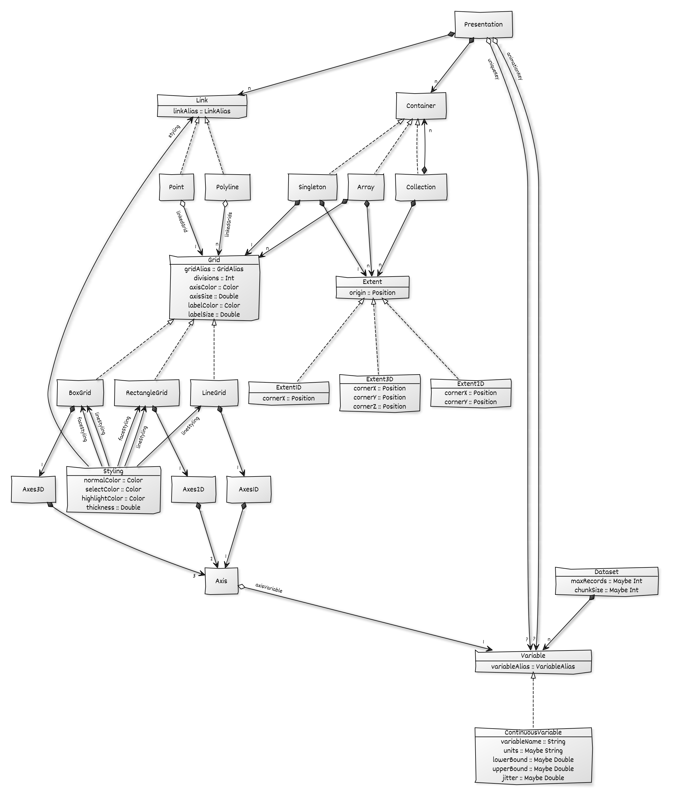
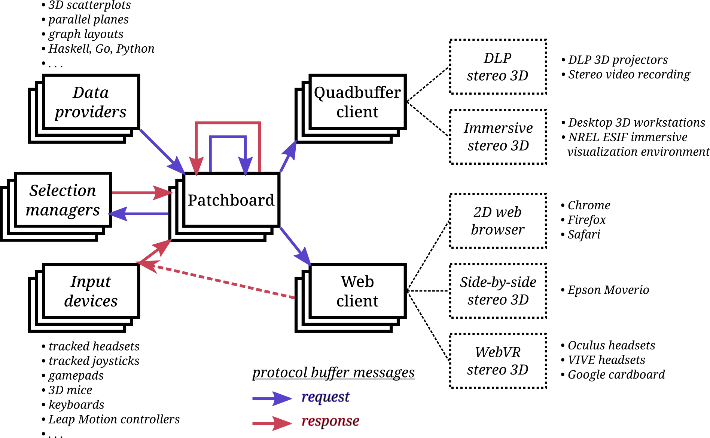

% InfoVis Parallel
% Technical Manual
% 2020-01-10

## Visualization language

## Architecture

## Protocol buffer specification

### Prelude

	syntax = "proto3";
	
	package Infovis;

### Request message

	message Request {
	  int32             show      = 1; // 0  = no change
	  string            message   = 2; // "" = no change
	  bool              reset     = 3;
	  repeated Geometry upsert    = 4;
	  repeated int64    delete    = 5;
	  Location          viewloc   = 6;
	  Location          toolloc   = 7;
	  Location          offsetloc = 8;
	}

### Response message

	message Response {
	  int32           shown     =  1;
	  string          message   =  2;
	  repeated int64  hover     =  3;
	  repeated int64  unhover   =  4;
	  repeated int64  select    =  5;
	  repeated int64  deselect  =  6;
	  Location        viewloc   =  7;
	  Location        toolloc   =  8;
	  Location        offsetloc =  9;
	  fixed32         depressed = 10;
	  fixed32         pressed   = 11;
	  fixed32         released  = 12;
	  repeated double analog    = 13;
	}

### Geometry message

	message Geometry {
	  int32           fram =  1; // 0 = all
	  int64           iden =  2;
	  int32           type =  3; // 0 = all, 1 = points, 2 = polylines,
	                             // 3 = rectangles, 4 = label, 5 = axis
	  int32           mask =  4;
	  repeated int32  cnts =  5;
	  repeated double posx =  6; // mask = 00001b = 1
	  repeated double posy =  7; // mask = 00001b = 1
	  repeated double posz =  8; // mask = 00001b = 1
	  double          size =  9; // mask = 00010b = 2
	  fixed32         colr = 10; // mask = 00100b = 4
	  string          text = 11; // mask = 01000b = 8
	  int32           glyp = 12; // mask = 10000b = 16;
	                             // 0 = cubes/boxes for points/polylines,
	                             // 1 = spheres/cylinders
	}

### Location message

	message Location {
	  double posx = 1;
	  double posy = 2;
	  double posz = 3;
	  double rotw = 4;
	  double rotx = 5;
	  double roty = 6;
	  double rotz = 7;
	}

## Patchboard command-line application

	absorber 'sink'
	add-sink 'relay' [sink]...
	add-source 'relay' [source]...
	append 'source' [filename]...
	converter 'relay' [show] [view] [tool] [offset]
	delete [source|sink|relay]...
	exit
	files 'source' [filename]...
	filter 'relay' [show] [message] [reset] [upsert] [delete] [view] [tool] [offset]
	help
	kafka 'address' [true|false] 'topic'
	printer 'sink' (Request|Response)
	relay 'relay'
	relays
	remove-sink 'relay' [sink]...
	remove-source 'relay' [source]...
	reset [source]...
	script [file]...
	serve 'address' 'path'
	silent
	sinks
	sources
	verbose
	wait 'seconds'
	websocket 'path'
